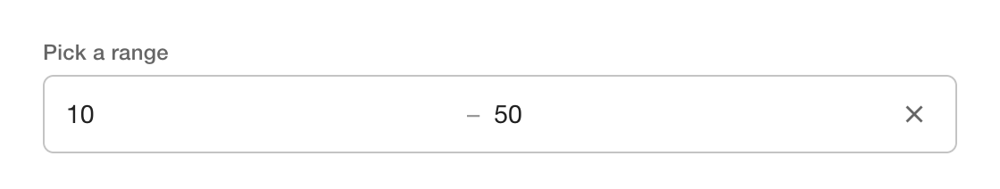
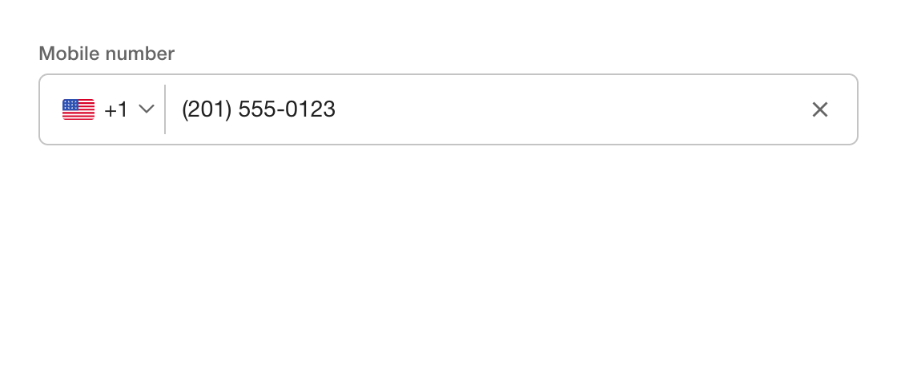
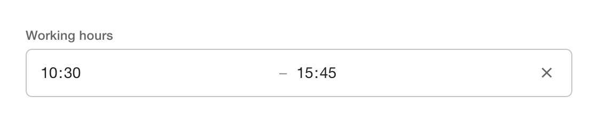

<div align="center">

# ngx-libs-workspace

**A small family of reactive Angular form controls — built on Signal Forms,
themable via CSS custom properties, and free of Angular Material, CDK and
`ControlValueAccessor`.**

[](https://github.com/dineeek/ngx-libs-workspace/actions/workflows/ci.yml)
[](https://github.com/dineeek/ngx-libs-workspace/actions/workflows/deploy-playground.yml)
[](https://github.com/dineeek/ngx-libs-workspace/actions/workflows/codeql.yml)
[](https://coveralls.io/github/dineeek/ngx-libs-workspace?branch=main)
[](https://app.fossa.com/projects/git%2Bgithub.com%2Fdineeek%2Fngx-libs-workspace?ref=badge_shield)

[**Live playground** ↗](https://dineeek.github.io/ngx-libs-workspace) ·
[Releases](https://github.com/dineeek/ngx-libs-workspace/releases) ·
[Issues](https://github.com/dineeek/ngx-libs-workspace/issues)

</div>

---

## The libraries

| Library                                                                                                                                                                                                                                                                                                                                    | What it is                                                                                                                         | npm                                                                                                                                                                                                                                                                                                                       | Demo                                                                                  |
| ------------------------------------------------------------------------------------------------------------------------------------------------------------------------------------------------------------------------------------------------------------------------------------------------------------------------------------------ | ---------------------------------------------------------------------------------------------------------------------------------- | ------------------------------------------------------------------------------------------------------------------------------------------------------------------------------------------------------------------------------------------------------------------------------------------------------------------------- | ------------------------------------------------------------------------------------- |
| [**ngx-pass-code**](./libs/ngx-pass-code)<br/><sub>OTP / pass-code input — one box per character, with paste-anywhere, autofocus/autoblur, and `text` / `number` / `password` modes.</sub>                                                                                                                                                 |                           | [](https://www.npmjs.com/package/ngx-pass-code) [](https://www.npmjs.com/package/ngx-pass-code)                                                             | [try it ↗](https://dineeek.github.io/ngx-libs-workspace/ngx-pass-code)                |
| [**ngx-numeric-range-form-field**](./libs/ngx-numeric-range-form-field)<br/><sub>Composite numeric range — two number inputs, one value. Four composable validators for order, bounds, completeness and span.</sub>                                                                                                                        |  | [](https://www.npmjs.com/package/ngx-numeric-range-form-field) [](https://www.npmjs.com/package/ngx-numeric-range-form-field) | [try it ↗](https://dineeek.github.io/ngx-libs-workspace/ngx-numeric-range-form-field) |
| [**ngx-phone-form-field**](./libs/ngx-phone-form-field)<br/><sub>International phone field — country picker with flags + national-number input as a single E.164 string. Powered by `libphonenumber-js/max`.</sub>                                                                                                                         |                  | [](https://www.npmjs.com/package/ngx-phone-form-field) [](https://www.npmjs.com/package/ngx-phone-form-field)                                 | [try it ↗](https://dineeek.github.io/ngx-libs-workspace/ngx-phone-form-field)         |
| [**ngx-time-range-form-field**](./libs/ngx-time-range-form-field)<br/><sub>Composite time range — two `<input type="time">` fields, one value. Four composable validators for order, bounds, completeness and span; mixed `HH:mm` / `HH:mm:ss` precision normalised before comparison.</sub>                                               |        | [](https://www.npmjs.com/package/ngx-time-range-form-field) [](https://www.npmjs.com/package/ngx-time-range-form-field)             | [try it ↗](https://dineeek.github.io/ngx-libs-workspace/ngx-time-range-form-field)    |
| [**ngx-overflow-tooltip**](./libs/ngx-overflow-tooltip)<br/><sub>Headless directive — flags whether a host element's text is ellipsized via `ResizeObserver` + `MutationObserver`, exposes an `isTruncated` signal so any tooltip surface (Material, custom popover, plain `title`) only fires when the content is actually clipped.</sub> |              | [](https://www.npmjs.com/package/ngx-overflow-tooltip) [](https://www.npmjs.com/package/ngx-overflow-tooltip)                                 | [try it ↗](https://dineeek.github.io/ngx-libs-workspace/ngx-overflow-tooltip)         |

---

## What every lib in here gives you

- Standalone — no module to register, no peer dep on Angular Material, CDK or
  any third-party runtime.
- Signal-based inputs end-to-end. Form-field libs implement `FormValueControl`
  and plug into a parent `form()` schema via `[formField]`; the directive lib
  (`ngx-overflow-tooltip`) exposes its state as a public signal.
- Form-field libs ship outlined styling reskinnable via CSS custom properties —
  no `::ng-deep`, no global CSS leaks. Schema-driven validation (`required`,
  `readonly`, `disabled`, `validate`, …) is owned by the consumer's `form()`
  definition.
- OnPush change detection, zoneless-friendly setup.
- Tree-shakable (`sideEffects: false`), npm-published with provenance.

> The form-field libs target `@angular/forms/signals`, which is marked
> `@experimental 21.0.0`. Consumers adopt the same experimental surface.

---

## Workspace layout

```
ngx-libs-workspace/
├─ apps/
│  ├─ playground/          # demo app deployed to GitHub Pages
│  └─ playground-e2e/      # Cypress end-to-end tests
└─ libs/
   ├─ ngx-pass-code/                    # publishable
   ├─ ngx-numeric-range-form-field/     # publishable
   ├─ ngx-phone-form-field/             # publishable
   ├─ ngx-time-range-form-field/        # publishable
   └─ ngx-overflow-tooltip/             # publishable
```

---

## Quick start

```shell
corepack enable
pnpm install --frozen-lockfile
pnpm nx serve playground   # → http://localhost:4200
```

The playground live-reloads on source changes and consumes all five libraries
directly from `libs/` — no rebuild needed.

> Requires Node.js `>=20.19` (see [`.nvmrc`](.nvmrc)) and pnpm `>=10` (pinned in
> `package.json`).

---

## Daily commands

All commands run from the repo root via pnpm. Every command is Nx-cached —
re-runs return instantly when nothing changed.

<details>
<summary><b>Lint</b></summary>

```shell
pnpm nx lint ngx-pass-code
pnpm nx lint ngx-numeric-range-form-field
pnpm nx lint ngx-phone-form-field
pnpm nx run-many -t lint            # everything
pnpm nx affected -t lint            # only what changed vs. main
```

</details>

<details>
<summary><b>Test</b></summary>

```shell
pnpm nx test ngx-pass-code
pnpm nx test ngx-numeric-range-form-field
pnpm nx test ngx-phone-form-field
pnpm nx run-many -t test            # everything
pnpm nx affected -t test            # only what changed vs. main
```

Coverage for the publishable libraries:

```shell
pnpm ngx-pass-code:test:ci
pnpm ngx-numeric-range-form-field:test:ci
pnpm ngx-phone-form-field:test:ci
```

</details>

<details>
<summary><b>Build</b></summary>

```shell
pnpm nx build ngx-pass-code                   # → dist/libs/ngx-pass-code
pnpm nx build ngx-numeric-range-form-field    # → dist/libs/ngx-numeric-range-form-field
pnpm nx build ngx-phone-form-field            # → dist/libs/ngx-phone-form-field
pnpm nx build playground                      # → dist/apps/playground
pnpm nx run-many -t build                     # everything
```

</details>

<details>
<summary><b>Library publish dry-run</b></summary>

```shell
pnpm ngx-pass-code:publish:dry-run
pnpm ngx-numeric-range-form-field:publish:dry-run
pnpm ngx-phone-form-field:publish:dry-run
```

</details>

<details>
<summary><b>Workspace graph</b></summary>

```shell
pnpm nx graph
```

</details>

---

## Releasing libraries

Publishing is fully automated for every library in this workspace:

1. Commit to `main` using
   [Conventional Commits](https://www.conventionalcommits.org/) (`feat:`,
   `fix:`, `feat!:`, …). Affected files determine which library gets a release
   PR.
2. [`release-please`](./.github/workflows/release-please.yml) opens/updates a
   release PR per library, bumping `libs/<lib>/package.json` and `CHANGELOG.md`.
3. Merging the release PR creates a GitHub Release + tag of the form
   `<lib-name>@x.y.z` (e.g. `ngx-pass-code@2.0.1`,
   `ngx-phone-form-field@1.0.0`).
4. The tag triggers the matching publish workflow:
   - [`publish-ngx-pass-code.yml`](./.github/workflows/publish-ngx-pass-code.yml)
   - [`publish-ngx-numeric-range-form-field.yml`](./.github/workflows/publish-ngx-numeric-range-form-field.yml)
   - [`publish-ngx-phone-form-field.yml`](./.github/workflows/publish-ngx-phone-form-field.yml)
   - [`publish-ngx-time-range-form-field.yml`](./.github/workflows/publish-ngx-time-range-form-field.yml)
   - [`publish-ngx-overflow-tooltip.yml`](./.github/workflows/publish-ngx-overflow-tooltip.yml)

   Each runs `nx build <lib> --configuration=production` and
   `npm publish --provenance --access public` using the `NPM_TOKEN` repo secret
   (OIDC-backed provenance).

Consumer-facing docs live in each lib's README — see the table at the top.

---

## Contributing

1. Create a feature branch off `main`.
2. Commit with Conventional Commit messages — a `commit-msg` husky hook runs
   [commitlint](https://commitlint.js.org) to enforce this.
3. Pre-commit runs Prettier on staged files and `nx affected -t lint` on the
   affected projects.
4. Open a PR; CI (`ci.yml`) runs `lint`, `test`, `build` in parallel via
   `nx affected` and publishes coverage to Coveralls.

---

## License

MIT © Dino Klicek · See the
[FOSSA report](https://app.fossa.com/projects/git%2Bgithub.com%2Fdineeek%2Fngx-libs-workspace).
