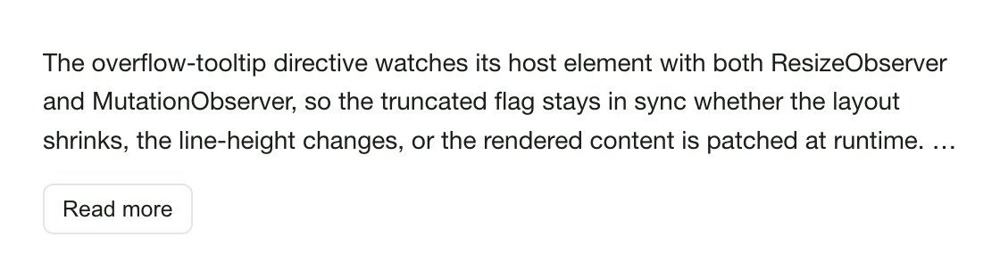
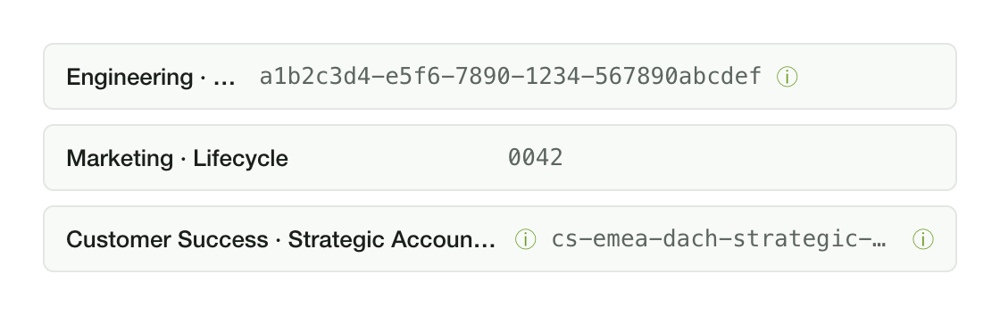
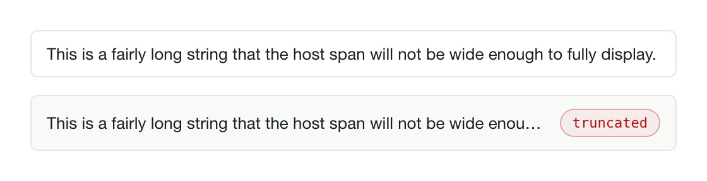

# ngx-overflow-tooltip

A reactive Angular standalone directive that detects when a host element's text
is **ellipsized / truncated** and exposes a typed `isTruncated` signal — so a
tooltip, "Read more" button, or any other reveal affordance only shows when the
visible content is actually clipped. Built for Angular 21 / signals / zoneless.
No `@angular/material` peer dependency.



<p align="start">
    <a href="https://www.npmjs.com/package/ngx-overflow-tooltip"></a>
    <a href="https://www.npmjs.com/package/ngx-overflow-tooltip"></a>
    <a href="https://bundlephobia.com/package/ngx-overflow-tooltip"></a>
</p>

[](https://github.com/dineeek/ngx-libs-workspace/actions/workflows/ci.yml)
[](https://coveralls.io/github/dineeek/ngx-libs-workspace?branch=main)
[](https://github.com/prettier/prettier)

**[Live demo](https://dineeek.github.io/ngx-libs-workspace/ngx-overflow-tooltip)**
· **[Changelog](./CHANGELOG.md)**

## Why this exists

`MatTooltip` (and most other tooltip surfaces) doesn't know whether its host
element's text is actually clipped. So a common UI papercut: tooltips fire on
every list row, even the short ones whose text fits comfortably. This directive
plugs that gap.

The closest existing Angular package
([ngx-ellipsis-tooltip](https://www.npmjs.com/package/ngx-ellipsis-tooltip))
hasn't been touched since 2022 (Angular 11). The closely-named
[ngx-ellipsis](https://www.npmjs.com/package/ngx-ellipsis) does the opposite job
— it _forces_ multi-line truncation rather than _detecting_ it.

## Features

- Standalone directive — no module to register, no peer dep on
  `@angular/material` or any third party
- Reactive `isTruncated` signal output — read it from a template via the
  `exportAs` ref, or from code
- Three modes — `auto` (default, both axes), `single` (horizontal only), `multi`
  (vertical only); the bare attribute defaults to `auto`
- Re-measures via `ResizeObserver` on layout changes **and** `MutationObserver`
  on content changes — handles dynamic text and hot-swapped DOM children
- rAF-coalesced — back-to-back observer callbacks collapse into a single
  measurement pass
- Runs measurements outside the Angular zone; only the signal flip re-enters
  when the value actually changes
- SSR-safe — skips wiring entirely when `ResizeObserver` is missing
- Works with zoneless Angular (`provideExperimentalZonelessChangeDetection`)
- `truncatedChange` output for code-side consumers
- Tree-shakable (`sideEffects: false`)

## At a glance

|                                                             |                                                                    |
| ----------------------------------------------------------- | ------------------------------------------------------------------ |
| **Single-line rows**<br/> | **Multi-line clamp**<br/> |
| **Live content**<br/>     |                                                                    |

## Install

```shell
npm install ngx-overflow-tooltip
```

Peer dependencies: `@angular/common`, `@angular/core` (both `>=21.0.0 <22.0.0`).

## Usage

The directive is headless — bring your own reveal affordance.

### With Angular Material `MatTooltip`

```typescript
import { Component } from '@angular/core'
import { MatTooltipModule } from '@angular/material/tooltip'
import { OverflowTooltipDirective } from 'ngx-overflow-tooltip'

@Component({
  selector: 'app-row',
  standalone: true,
  imports: [OverflowTooltipDirective, MatTooltipModule],
  template: `
    <span
      ngxOverflowTooltip
      #oft="ngxOverflowTooltip"
      class="single-line"
      [matTooltip]="fullText"
      [matTooltipDisabled]="!oft.isTruncated()"
    >
      {{ fullText }}
    </span>
  `,
  styles: [
    `
      .single-line {
        display: inline-block;
        max-width: 240px;
        white-space: nowrap;
        overflow: hidden;
        text-overflow: ellipsis;
      }
    `
  ]
})
export class RowComponent {
  readonly fullText = 'Engineering · Platform · Observability · 2026 cohort'
}
```

The `MatTooltip` only fires when `oft.isTruncated()` is `true`. No tooltip on
rows whose text fits.

### With a plain `title` attribute (no third-party deps)

```html
<span
  ngxOverflowTooltip
  #oft="ngxOverflowTooltip"
  class="single-line"
  [title]="oft.isTruncated() ? fullText : ''"
>
  {{ fullText }}
</span>
```

### "Read more" toggle on multi-line content

```html
<p [ngxOverflowTooltip]="'multi'" #oft="ngxOverflowTooltip" class="clamp-3">
  {{ longDescription }}
</p>
@if (oft.isTruncated() || expanded()) {
<button type="button" (click)="expanded.set(!expanded())">
  {{ expanded() ? 'Show less' : 'Read more' }}
</button>
}
```

```css
.clamp-3 {
  display: -webkit-box;
  -webkit-line-clamp: 3;
  line-clamp: 3;
  -webkit-box-orient: vertical;
  overflow: hidden;
}
```

### Reading the signal from a parent component

```typescript
@Component({
  imports: [OverflowTooltipDirective],
  template: `
    <span ngxOverflowTooltip (truncatedChange)="onTruncated($event)">
      {{ text }}
    </span>
  `
})
export class ParentComponent {
  onTruncated(value: boolean): void {
    // fires only when the flag flips
  }
}
```

Or grab the directive instance via `viewChild`:

```typescript
import { viewChild } from '@angular/core'

readonly oft = viewChild.required(OverflowTooltipDirective)

constructor() {
  effect(() => {
    if (this.oft().isTruncated()) {
      // …
    }
  })
}
```

## API

### Inputs

| Input                | Type                            | Default  | Description                                                                                                                                                                |
| -------------------- | ------------------------------- | -------- | -------------------------------------------------------------------------------------------------------------------------------------------------------------------------- |
| `ngxOverflowTooltip` | `'auto' \| 'single' \| 'multi'` | `'auto'` | The detection mode. Aliased onto the selector so you can pass it inline: `[ngxOverflowTooltip]="'single'"`. The bare attribute (`<span ngxOverflowTooltip>`) means `auto`. |

### Outputs

| Output            | Type      | Description                                                                               |
| ----------------- | --------- | ----------------------------------------------------------------------------------------- |
| `truncatedChange` | `boolean` | Emits **only when the truncation flag flips**, not on every observer fire. Stays in sync. |

### Public surface

| Member            | Type                          | Description                                                                                    |
| ----------------- | ----------------------------- | ---------------------------------------------------------------------------------------------- |
| `mode`            | `Signal<OverflowTooltipMode>` | The active mode signal — read-only from outside.                                               |
| `isTruncated`     | `Signal<boolean>`             | The truncation flag. Read from a template via the `exportAs` ref or from code via `viewChild`. |
| `truncatedChange` | `OutputEmitterRef<boolean>`   | Subscribable change output (see above).                                                        |

### `exportAs`

```html
<span ngxOverflowTooltip #oft="ngxOverflowTooltip"> {{ text }} </span>
```

`#oft` is a reference of type `OverflowTooltipDirective` that the rest of the
template can read.

## Detection modes

| Mode     | Compares                                                         | When to use                                                                         |
| -------- | ---------------------------------------------------------------- | ----------------------------------------------------------------------------------- |
| `auto`   | `scrollWidth > clientWidth` **or** `scrollHeight > clientHeight` | Default — covers single-line ellipsis and multi-line clamps in one binding.         |
| `single` | `scrollWidth > clientWidth`                                      | A single-line text node where vertical overflow would never happen anyway.          |
| `multi`  | `scrollHeight > clientHeight`                                    | A clamped paragraph (`-webkit-line-clamp`) where horizontal overflow is irrelevant. |

## How it measures

1. On `afterNextRender`, the directive attaches a `ResizeObserver` to the host
   element so layout changes (window resize, container reflow, font load)
   re-trigger a check.
2. It also attaches a `MutationObserver` with
   `{ childList, subtree, characterData }` so changes to the rendered text —
   including when the host's bound text expression changes — re-trigger a check
   too. The directive this lib was extracted from only reacted to resize, which
   missed the dynamic-content case.
3. Both observer callbacks fire **outside the Angular zone** — measurements
   don't tick the change-detector unless they have to. The callbacks coalesce
   into a single `requestAnimationFrame` so a burst of mutations runs one
   measurement.
4. The measurement compares `scrollWidth` vs `clientWidth` and / or
   `scrollHeight` vs `clientHeight` based on `mode()`. Only when the result
   actually flips does the signal `set` (and `truncatedChange` emit) — so
   downstream consumers don't get spammed by every observer fire. The initial
   measurement (right after `afterNextRender`) and the re-check that follows a
   `mode` input change run on the standard Angular schedule rather than
   out-of-zone, since they're driven by render lifecycle and signal effects.
5. On destroy, both observers disconnect and any pending rAF is cancelled.

## SSR / older browsers

If `ResizeObserver` is undefined at construction time (typical for SSR
pre-render), the directive skips wiring entirely and leaves `isTruncated()` at
`false`. Hydration on the client side then runs the normal measurement path.

## License

MIT License — Copyright (c) 2026 Dino Klicek
