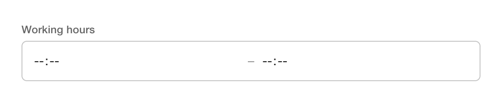
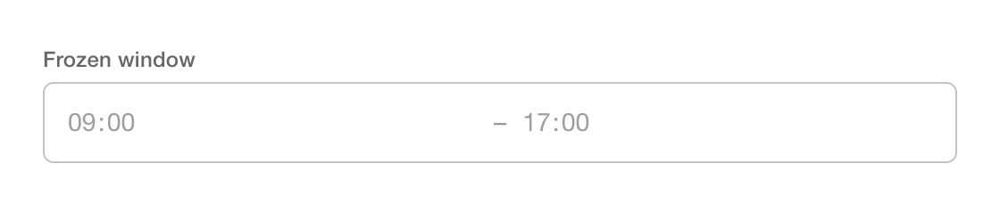
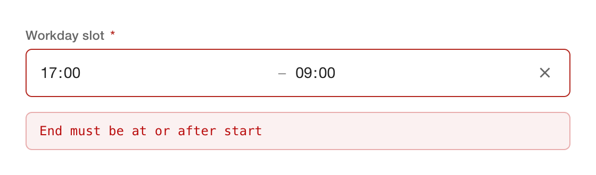
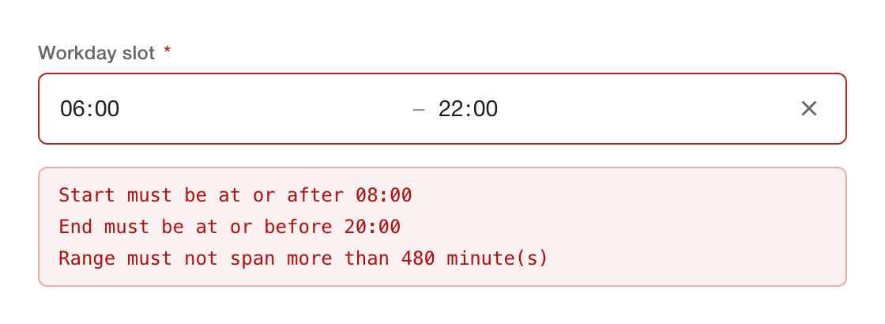

# ngx-time-range-form-field

A reactive Angular custom form control for a composite **time range** — two
`<input type="time">` fields (start, end) exposed as a single value. Built on
**Angular 21 Signal Forms** (`FormValueControl`) with no `ControlValueAccessor`,
no Angular Material, no third-party runtime dependencies.


<p align="start">
    <a href="https://www.npmjs.com/package/ngx-time-range-form-field"></a>
    <a href="https://www.npmjs.com/package/ngx-time-range-form-field"></a>
    <a href="https://bundlephobia.com/package/ngx-time-range-form-field"></a>
</p>

[](https://github.com/dineeek/ngx-libs-workspace/actions/workflows/ci.yml)
[](https://coveralls.io/github/dineeek/ngx-libs-workspace?branch=main)
[](https://github.com/prettier/prettier)

**[Live demo](https://dineeek.github.io/ngx-libs-workspace/ngx-time-range-form-field)**
· **[Changelog](./CHANGELOG.md)**

## Features

- Two-input composite time range rendered as one field
- Plug & play with Angular **Signal Forms** via `FormValueControl`
  (`[formField]`)
- Ships four composable validator helpers — `timeRangeOrderValid`,
  `timeRangeBounds`, `timeRangeBothFilled`, `timeRangeWidth`
- Mixed-precision (`HH:mm` ↔ `HH:mm:ss`) values compare safely; `09:00` matches
  `09:00:00`
- Typed `TimeRangeErrorKind` contract for error-key matching
- Schema-driven validation (`required`, `readonly`, `disabled`, `validate`, …)
  owned by the consumer's `form()` definition
- Accessible by default — visible label wires to the group via
  `aria-labelledby`; per-input announcements compose `<group> <side>`
- Native time-input attributes pass-through (`step`, `autocomplete`, per-side
  `name` / `min` / `max`)
- Custom outlined field styling — reskin via CSS custom properties without
  `::ng-deep`
- Tree-shakable (`sideEffects: false`)
- Zero runtime dependencies — no Angular Material, no CDK

> `@angular/forms/signals` is marked `@experimental 21.0.0`. Consumers of
> `ngx-time-range-form-field@0.x` adopt the same experimental surface.

## At a glance

|                                                              |                                                                            |
| ------------------------------------------------------------ | -------------------------------------------------------------------------- |
| **Empty**<br/>           | **Filled**<br/>                      |
| **Read-only**<br/> | **Invalid order**<br/> |

## Install

```shell
npm install ngx-time-range-form-field
```

Peer dependencies: `@angular/common`, `@angular/core`, `@angular/forms` (all
`>=21.0.0 <22.0.0`).

## Usage

```typescript
import { Component, signal } from '@angular/core'
import { form, FormField, required } from '@angular/forms/signals'
import {
  ITimeRange,
  TimeRangeFormFieldComponent,
  timeRangeOrderValid
} from 'ngx-time-range-form-field'

@Component({
  selector: 'app-hours-demo',
  standalone: true,
  imports: [TimeRangeFormFieldComponent, FormField],
  template: `
    <ngx-time-range-form-field [formField]="rangeForm" label="Working hours" />
  `
})
export class HoursDemoComponent {
  readonly rangeValue = signal<ITimeRange | null>({
    start: '09:00',
    end: '17:00'
  })

  readonly rangeForm = form<ITimeRange | null>(this.rangeValue, p => {
    required(p)
    timeRangeOrderValid(p)
  })
}
```

The emitted value type:

```typescript
type ITimeRange = {
  start: string | null
  end: string | null
}
```

Each side is either `null` (cleared) or an `HH:mm` / `HH:mm:ss` string emitted
by the underlying `<input type="time">`. The wire format passes through
unchanged — no Date conversion, no timezone surprises. When both sides are
`null`, the value itself becomes `null`.

## Inputs

All inputs are signal inputs. Inputs marked **(schema-driven)** are
automatically written by the `FormField` directive from the attached `form()`
schema — bind them directly only when using the component without `[formField]`.

| Input                      | Type                                               | Default         | Description                                                                                                                                            |
| -------------------------- | -------------------------------------------------- | --------------- | ------------------------------------------------------------------------------------------------------------------------------------------------------ |
| `label`                    | `string`                                           | `''`            | Visible label rendered above the field. When set, becomes the group's `aria-labelledby` target.                                                        |
| `startPlaceholder`         | `string`                                           | `'Start'`       | Placeholder for the start input.                                                                                                                       |
| `endPlaceholder`           | `string`                                           | `'End'`         | Placeholder for the end input.                                                                                                                         |
| `startLabel`               | `string \| null`                                   | `null`          | Override the start input's accessible name. Defaults to `startPlaceholder` when `null`.                                                                |
| `endLabel`                 | `string \| null`                                   | `null`          | Override the end input's accessible name. Defaults to `endPlaceholder` when `null`.                                                                    |
| `resetLabel`               | `string`                                           | `'Reset range'` | `aria-label` for the reset (✕) button.                                                                                                                 |
| `resettable`               | `boolean`                                          | `true`          | Show the reset (✕) button when a value is present.                                                                                                     |
| `startReadonly`            | `boolean`                                          | `false`         | Make the start input read-only while the end remains editable.                                                                                         |
| `endReadonly`              | `boolean`                                          | `false`         | Mirror of `startReadonly` for the end input.                                                                                                           |
| `step`                     | `number \| string \| null`                         | `null`          | Native `step` attribute forwarded to both inputs. `60` keeps the picker at minute precision; `1` switches to `HH:mm:ss`.                               |
| `autocomplete`             | `string \| null`                                   | `null`          | Native `autocomplete` attribute forwarded to both inputs (e.g. `'off'`).                                                                               |
| `startName` / `endName`    | `string \| null`                                   | `null`          | Per-side native `name` attribute — useful inside a native `<form>`.                                                                                    |
| `startMin` / `startMax`    | `string \| null`                                   | `null`          | Per-side native HTML `min` / `max` attributes for the **start** input. Steers the browser picker only — schema validation remains the source of truth. |
| `endMin` / `endMax`        | `string \| null`                                   | `null`          | Per-side native HTML `min` / `max` for the **end** input.                                                                                              |
| `value` (schema-driven)    | `ITimeRange \| null`                               | `null`          | Composite value. Two-way via `[(value)]` or through `form()`.                                                                                          |
| `disabled` (schema-driven) | `boolean`                                          | `false`         | Disable both inputs.                                                                                                                                   |
| `readonly` (schema-driven) | `boolean`                                          | `false`         | Render both inputs read-only.                                                                                                                          |
| `required` (schema-driven) | `boolean`                                          | `false`         | Show the required marker on the label. Visual flag — the actual validity comes from your `form()` schema.                                              |
| `touched` (schema-driven)  | `boolean`                                          | `false`         | Marks the field as touched — flips the invalid styling on when paired with `errors`.                                                                   |
| `errors` (schema-driven)   | `readonly ValidationError.WithOptionalFieldTree[]` | `[]`            | Error list. Non-empty + touched paints the field red.                                                                                                  |

## Schema validators

The lib ships four helpers that compose into any `form()` schema. Unless noted
otherwise they treat a `null` on either side as "not yet set" and pass in that
case — pair them with `required(p)` or `timeRangeBothFilled(p)` when
"half-filled" should be rejected.

### `timeRangeOrderValid(path)`

Fails with `{ kind: 'invalidRange' }` when `end < start`. Mixed-precision
strings (`'17:00'` vs `'17:00:00'`) are normalised before comparison.


```typescript
import { timeRangeOrderValid } from 'ngx-time-range-form-field'

rangeForm = form<ITimeRange | null>(this.rangeValue, p => {
  timeRangeOrderValid(p)
})
```

### `timeRangeBounds(path, { min, max })`

Keeps both sides within consumer-supplied time-of-day bounds (`HH:mm` or
`HH:mm:ss`). Emits `{ kind: 'min' }` when a side is earlier than the floor and
`{ kind: 'max' }` when a side is later than the ceiling. Pass `min` or `max`
alone for one-sided bounds.



```typescript
import { timeRangeBounds } from 'ngx-time-range-form-field'

rangeForm = form<ITimeRange | null>(this.rangeValue, p => {
  timeRangeBounds(p, { min: '08:00', max: '20:00' })
})
```

### `timeRangeBothFilled(path)`

Fails with `{ kind: 'incomplete' }` until **both** sides are populated.
`required(p)` alone only checks that the composite value is not `null`, so
`{ start: '09:00', end: null }` passes it — use this helper when you need the
stronger guarantee.

```typescript
import { timeRangeBothFilled } from 'ngx-time-range-form-field'

rangeForm = form<ITimeRange | null>(this.rangeValue, p => {
  timeRangeBothFilled(p)
})
```

### `timeRangeWidth(path, { min, max })`

Constrains the _span_ of the range (`end - start`, in minutes), not the
endpoints. Emits `{ kind: 'minWidth' }` when the span is below `bounds.min` and
`{ kind: 'maxWidth' }` when it exceeds `bounds.max`; both carry a readable
`message`. Skipped while either side is `null` or the range is mis-ordered (let
`timeRangeOrderValid` own that case). Fractional values are accepted for
sub-minute precision. The `{ min, max }` shape mirrors `numericRangeWidth` from
the sibling `ngx-numeric-range-form-field` lib — the unit (minutes) is
documented here.

```typescript
import { timeRangeWidth } from 'ngx-time-range-form-field'

// At least 30 min, at most 8 hours.
rangeForm = form<ITimeRange | null>(this.rangeValue, p => {
  timeRangeWidth(p, { min: 30, max: 480 })
})
```

Reading errors in a template:

```html
@for (err of rangeForm().errors(); track $index) {
<p class="error">{{ err.message || err.kind }}</p>
}
```

### Typed error-kind contract

Filter errors by typed constants instead of duplicating string literals:

```typescript
import { TimeRangeErrorKind } from 'ngx-time-range-form-field'

const hasOrderError = rangeForm()
  .errors()
  .some(e => e.kind === TimeRangeErrorKind.OutOfOrder)
```

| Constant                        | Emitted by                      | `kind` value     |
| ------------------------------- | ------------------------------- | ---------------- |
| `TimeRangeErrorKind.OutOfOrder` | `timeRangeOrderValid`           | `'invalidRange'` |
| `TimeRangeErrorKind.BoundsMin`  | `timeRangeBounds` (lower bound) | `'min'`          |
| `TimeRangeErrorKind.BoundsMax`  | `timeRangeBounds` (upper bound) | `'max'`          |
| `TimeRangeErrorKind.Incomplete` | `timeRangeBothFilled`           | `'incomplete'`   |
| `TimeRangeErrorKind.WidthMin`   | `timeRangeWidth` (lower span)   | `'minWidth'`     |
| `TimeRangeErrorKind.WidthMax`   | `timeRangeWidth` (upper span)   | `'maxWidth'`     |

The string values match the kinds the validators emit today, and they are
intentionally the same as the sibling `ngx-numeric-range-form-field` library so
consumers using both can share branching logic.

## Accessibility

When `label` is set the component wires the visible label to the `role="group"`
via `aria-labelledby` using stable per-instance IDs, and each input's
`aria-label` composes `<group label> <side label>` — a screen reader announces
e.g. _"Working hours Start"_ and _"Working hours End"_ instead of just _"Start"_
/ _"End"_. Override the per-side announcement with `startLabel` / `endLabel`, or
the reset button announcement with `resetLabel`.

## Styling

The component ships a minimal outlined field. Override these custom properties
on the host (or anywhere in the cascade) to restyle:

| Property                        | Default               |
| ------------------------------- | --------------------- |
| `--ngx-trff-font-family`        | `inherit`             |
| `--ngx-trff-font-size`          | `0.95rem`             |
| `--ngx-trff-label-font-size`    | `0.8rem`              |
| `--ngx-trff-label-color`        | `rgba(0, 0, 0, 0.6)`  |
| `--ngx-trff-text-color`         | `rgba(0, 0, 0, 0.87)` |
| `--ngx-trff-placeholder-color`  | `rgba(0, 0, 0, 0.4)`  |
| `--ngx-trff-border-color`       | `rgba(0, 0, 0, 0.23)` |
| `--ngx-trff-border-hover-color` | `rgba(0, 0, 0, 0.52)` |
| `--ngx-trff-focus-color`        | `#1976d2`             |
| `--ngx-trff-error-color`        | `#b3261e`             |
| `--ngx-trff-background`         | `transparent`         |
| `--ngx-trff-disabled-color`     | `rgba(0, 0, 0, 0.38)` |
| `--ngx-trff-radius`             | `6px`                 |
| `--ngx-trff-padding-y`          | `10px`                |
| `--ngx-trff-padding-x`          | `12px`                |
| `--ngx-trff-gap`                | `8px`                 |

## License

MIT License — Copyright (c) 2026 Dino Klicek
